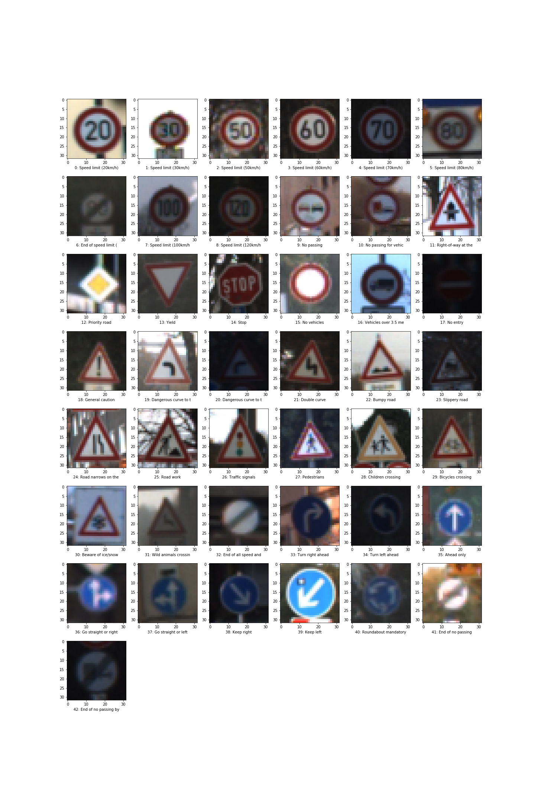
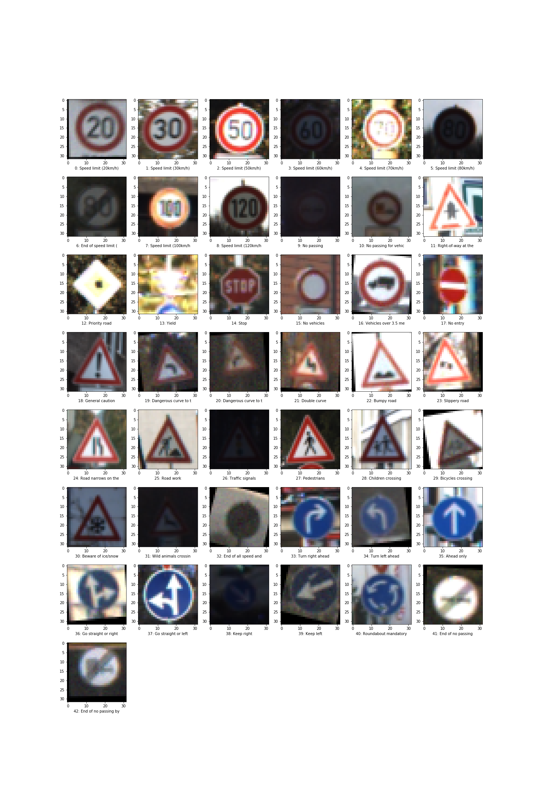
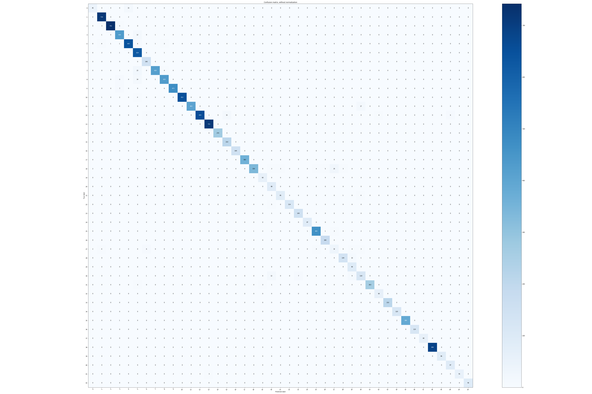
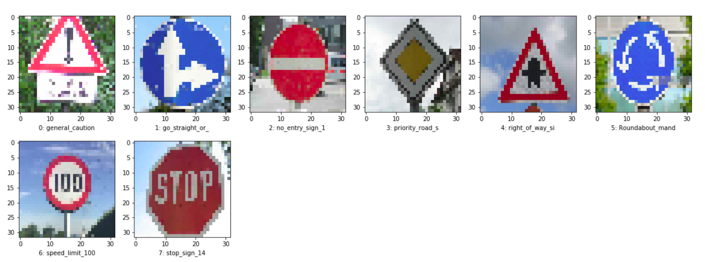
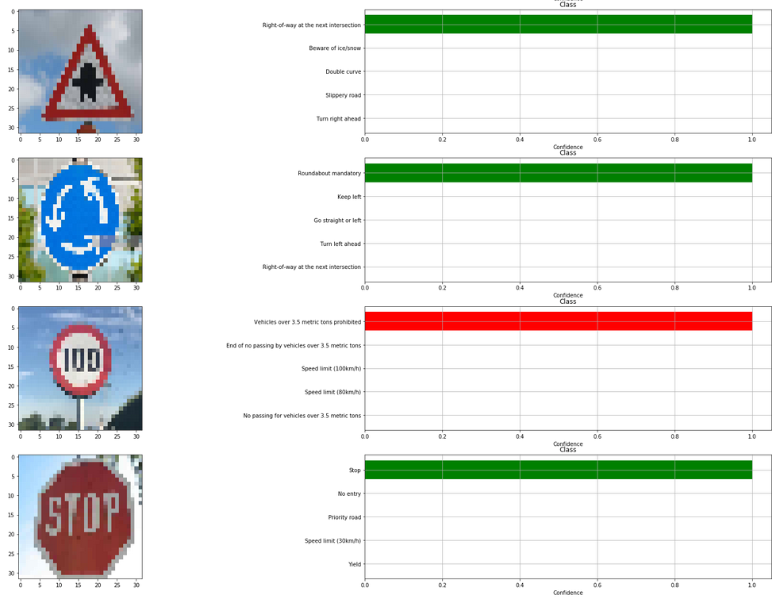
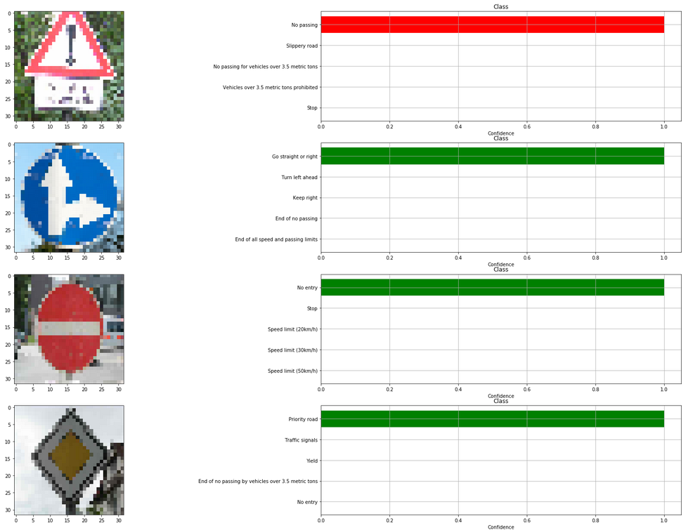

<!-- 
**********************************************************************
https://review.udacity.com/#!/rubrics/481/view 

Project Specification
Traffic Sign Classification

Dataset Exploration:
    OK - 1 - Dataset Summary: The submission includes a basic summary of the data set.
    OK - 2 - Exploratory Visualization: The submission includes an exploratory visualization on the dataset.

Design and Test a Model Architecture:
    OK - 3 - Preprocessing: The submission describes the preprocessing techniques used and why these techniques were chosen.
    OK - 4 - Model Architecture: The submission provides details of the characteristics and qualities of the architecture, including the type of model used, the number of layers, and the size of each layer. Visualizations emphasizing particular qualities of the architecture are encouraged.
    OK - 5 - Model Training: The submission describes how the model was trained by discussing what optimizer was used, batch size, number of epochs and values for hyper-parameters.
    OK - 6 - The submission describes the approach to finding a solution. Accuracy on the validation set is 0.93 or greater.

Test a Model on New Images:
    7 - Acquiring New Images: The submission includes five new German Traffic signs found on the web, and the images are visualized. Discussion is made as to particular qualities of the images or traffic signs in the images that are of interest, such as whether they would be difficult for the model to classify.
    8 - Performance on New Images: The submission documents the performance of the model when tested on the captured images. The performance on the new images is compared to the accuracy results of the test set.
    9 - The top five softmax probabilities of the predictions on the captured images are outputted. The submission discusses how certain or uncertain the model is of its predictions.

Optional:
    OK - VISUALIZE LAYERS OF THE NEURAL NETWORK

**********************************************************************
-->

# **P3 - Building a Traffic Sign Recognition/Classifier** 

### **Description**

In this project, I used what I've learned about deep neural networks and convolutional neural networks to classify traffic signs. Specifically, I trained a model to classify traffic signs from the [German Traffic Sign Dataset](http://benchmark.ini.rub.de/?section=gtsrb&subsection=dataset).  

  

This repository is designed to be a simple, easy to use environment in which you can code run the Traffic Sign Classifier.  

The goals / steps of this project are the following:  
* Load the data set  
* Explore, summarize and visualize the data set  
* Design, train and test a model architecture  
* Use the model to make predictions on new images  
* Analyze the softmax probabilities of the new images  
* Summarize the results with a written report  

---  
### **Used Methods**  

The model is based on the LeNet architecture with some modifications. The tools and concepts that I used for the pipeline are Convolutional Neural Networks, Statical Invariance, Filters, Feature Map Sizes, CNNs visualization, Pooling, Backprop, regularization, Dropout, and others.  

---
### **How to run**

To run the pipeline just launch and run each block of the Jupyter notebook Be sure that you already download the [Traffic_Sign_Classifier.ipynb](https://github.com/JohnBetaCode/CarND-P3-Traffic_Sign_Classifier/blob/master/Traffic_Sign_Classifier.ipynb).  

Be sure that you already download the [German Traffic Sign Dataset](http://benchmark.ini.rub.de/?section=gtsrb&subsection=dataset) and is decompressed in the sub-folder `traffic-signs-data`.  

Tested on: python 3.5, OpenCV 3.0.0, UBUNTU 16.04, and TensorFlow 1.10.

Please feel free to change or modify any hyper-parameter or change the model architecture for training. Some util functions are in the file [utils.py](https://github.com/JohnBetaCode/CarND-P3-Traffic_Sign_Classifier/blob/master/utils.py) in case you want to check or modify something.

---
### Data Set Summary & Exploration

<!-- 1. Provide a basic summary of the data set. In the code, the analysis should be done using python, numpy and/or pandas methods rather than hardcoding results manually. -->

The pickled data is a dictionary with 4 key/value pairs:

- `'features'` is a 4D array containing raw pixel data of the traffic sign images, (num examples, width, height, channels).
- `'labels'` is a 1D array containing the label/class id of the traffic sign. The file `signnames.csv` contains id -> name mappings for each id.
- `'sizes'` is a list containing tuples, (width, height) representing the original width and height the image.
- `'coords'` is a list containing tuples, (x1, y1, x2, y2) representing coordinates of a bounding box around the sign in the image.

The function `summary_data_sets()` in [utils.py](https://github.com/JohnBetaCode/CarND-P3-Traffic_Sign_Classifier/blob/master/utils.py) summarizes the dataset and print for each class the amount of samples for training, validation and testing process, showing its percentage in the dataset.

  

<!-- #### 2. Include an exploratory visualization of the dataset. -->

Here is an exploratory visualization of the data set. It is a bar chart showing how the data is not equal distributed, this will be a problem when training due to somes calsses have a lot of information over others, which can produce over-fitting in these.  

  

*Figure 1. Datasets distribution* 

Next you can see a image for each class, to get an idea how's the form of samples and their characteristics, so we can get an idea what's the problem we're facing. Due to their brightness, resolution or form, some images are really hard to identify even for humans. We'll see how the model deals with these kind of samples.

  

*Figure 2. Random visualization of training dataset* 

---
### Design and Test a Model Architecture

#### Data Augmentation

<!-- #### 1. Describe how you preprocessed the image data. What techniques were chosen and why did you choose these techniques? Consider including images showing the output of each preprocessing technique. Pre-processing refers to techniques such as converting to gray-scale, normalization, etc. (OPTIONAL: As described in the "Stand Out Suggestions" part of the rubric, if you generated additional data for training, describe why you decided to generate additional data, how you generated the data, and provide example images of the additional data. Then describe the characteristics of the augmented training set like number of images in the set, number of images for each class, etc.) -->

In this specific case, it's possible to have low train error but high test error. The network will over-fits. The solution to is simply collect more training data but actually this is not possible, so we will have to use methods like data augmentation, regularization (e.g. dropout), etc. We can also think of new data representation so that train and test data becomes more similar. Data per-processing is one such method. 

As a first step, I coded a function to convert the images to gray-scale, normalize them (image-128./128.), and to apply rotation and translation operation.  

Definitely we should normalize our data for having different features in same scale, which is for accelerating learning process and for caring different features fairly without caring the scale. Remember, after training, the learning algorithm has learn to deal with the data in scaled form, so we have to normalize the test data with the normalizing parameters used for training data.  

Here is an example of an original image and an augmented image:  

  

*Figure 3. Example of data augmentation in random training sample* 

The difference between the original data set and the augmented data set is gray scaling, translation, rotation and Gaussian noise.  

The function `balance_data()` augment the data for those classes which has a low number of training samples and apply the transformations already explained.

  

*Figure 4. Balanced training dataset distribution*  

 

*Figure 5. Random visualization of balanced training dataset with transformations* 

Naturally, if you have a lot of parameters, we would need to show our machine learning model a proportional amount of examples, to get good performance. Also, the number of parameters we need is proportional to the complexity of the task our model has to perform. Neural networks aren’t smart, for instance, a poorly trained neural network would think that an image are distinct, if we apply rotation and translation operations. So, to get more data, we just need to make minor alterations to our existing dataset. Minor changes such as flips or translations or rotations. Our neural network would think these are distinct images anyway. A convolutional neural network that can robustly classify objects even if its placed in different orientations is said to have the property called invariance. More specifically, a CNN can be invariant to translation, viewpoint, size or illumination (Or a combination of the above). This essentially is the premise of data augmentation. In the real world scenario, we may have a dataset of images taken in a limited set of conditions. But, our target application may exist in a variety of conditions, such as different orientation, location, scale, brightness etc. We account for these situations by training our neural network with additional synthetically modified data.  

#### Model's Architecture

<!-- #### 2. Describe what your final model architecture looks like including model type, layers, layer sizes, connectivity, etc.) Consider including a diagram and/or table describing the final model. -->

My final model consisted of the following layers:

| Layer         		    | Description	        				    	| 
|:-------------------------:|:---------------------------------------------:| 
| Input         		    | 32x32x3 RGB image   							| 
| (Conv1) Convolution 5x5   | 1x1 stride, valid padding, outputs 28x28x24 	|
| (Conv1) RELU			    |												|
| (Conv1) Max pooling	    | 2x2 stride,  outputs 14x14x24 				|
| (Conv2) Convolution 5x5   | 1x1 stride, valid padding, outputs 10x10x64 	|
| (Conv2) RELU				|												|
| (Conv2) Max pooling	    | 2x2 stride, valid padding, outputs 5x5x64 	|
| (fc0)   FLATTEN		    | outputs 1600									|
| (fc0)   DROPOUT		    | Prob: 0.5										|
| (fc1)   Fully connected	| outputs 120      		                		|
| (fc1)   RELU				|												|
| (fc1)   DROPOUT		    | Prob: 0.5										|
| (fc2)   Fully connected	| outputs 84      		                		|
| (fc2)   RELU				|												|
| (fc2)   DROPOUT		    | Prob: 0.5										|
| (fc3)   Fully connected	| outputs 43 (Number of classes)           		|

<!-- #### 3. Describe how you trained your model. The discussion can include the type of optimizer, the batch size, number of epochs and any hyperparameters such as learning rate. -->

To train the model, I used `softmax_cross_entropy_with_logits()` function for logits, the function `AdamOptimizer()` as optimizer to minimize the `loss_operation` variable, a train for 150 epochs (`EPOCHS`) with batches size of 128 (`BATCH_SIZE`), learning rate of 0.0005 (`LEARNING_RATE`), using images with shape of (32, 32, 3) and datata augmentation.

As you can see

 

*Figure 6. Training time lapse* 

   

*Figure 7. Confusion matrix* 

  

*Figure 8. Normalized confusion matrix* 

<!-- #### 4. Describe the approach taken for finding a solution and getting the validation set accuracy to be at least 0.93. Include in the discussion the results on the training, validation and test sets and where in the code these were calculated. Your approach may have been an iterative process, in which case, outline the steps you took to get to the final solution and why you chose those steps. Perhaps your solution involved an already well known implementation or architecture. In this case, discuss why you think the architecture is suitable for the current problem. -->

My final model results were:
* training set accuracy of 100.00%
* validation set accuracy of 98.80% 
* test set accuracy of 97.07%

* What was the first architecture that was tried and why was it chosen?  
    * The start point was the original LeNet-5 arquitecture, if you dont have idea how to strat, LeNet is great help. The LeNet's arquitecture is enought to get first results over 88% acuaracy. LeNet is perfect to test that everything in your machine work propertly and data is good.  

* What were some problems with the initial architecture?
    * LeNet-5 is quite old, and it was created to classify digits, so for trafic sing images is necessary to extract more catheristic and LexNet could be limited for this.  

* How was the architecture adjusted and why was it adjusted? Typical adjustments could include choosing a different model architecture, adding or taking away layers (pooling, dropout, convolution, etc), using an activation function or changing the activation function. One common justification for adjusting an architecture would be due to over-fitting or under-fitting. A high accuracy on the training set but low accuracy on the validation set indicates over fitting; a low accuracy on both sets indicates under fitting.
    * The size of convolutinal layer was increment, so more features can be extract and get more presition, to avoid overfitting Dropout was used at the end of each fully conected layer. The syllabus of the lectures it is explained in great detail how the convolution layer adds a big number of parameters (weights, biases) and neurons. This layer, once trained, it is able to extract meaning patterns from the image. For lower layers those filters look like edge extractors. For higher layers, those primitive shapes are combined to describe more complex forms. Those filters involve a high number of parameters, and a big issue of the design of deep networks in how to be able to describe complex forms and still be able to reduce the number of parameters. Since neighboring pixels are strongly correlated (specially in lowest layers), it makes sense to reduce the size of the output by subsampling (pooling) the filter response. The further apart two pixels are from each other, the less correlated. Therefore, a big stride in the pooling layer leads to high information loss. Loosely speaking. A stride of 2 and a kernel size 2x2 for the pooling layer is a common choice.  

* Which parameters were tuned? How were they adjusted and why?

        LEARNING_RATE = 0.0005 
        DATA_AUGMENTA = 1   
        NUM_CHANNELS = 3  
        BATCH_SIZE = 128   
        EPOCHS = 150   
     
    *  `LEARNING_RATE` is a hyper-parameter that controls how much we are adjusting the weights of our network with respect the loss gradient. The lower the value, the slower we travel along the downward slope. While this might be a good idea (using a low learning rate) in terms of making sure that we do not miss any local minima, it could also mean that we’ll be taking a long time to converge — especially if we get stuck on a plateau region.

    * `DATA_AUGMENTA` Enables or disables the use of data augmentation, the reasons to use this were already explained.

    * `NUM_CHANNELS` Number of channels in samples, if setted as 1 the datasets will be converted to grayscale images, to color features will be not extracted.

    * `BATCH_SIZE` The batch size is a hyperparameter that defines the number of samples to work through before updating the internal model parameters. This value can be increased as more memory is available. 128 is a standard value.

    * `EPOCHS` The number of epochs is a hyperparameter of gradient descent that controls the number of complete passes through the training dataset. One epoch means that each sample in the training dataset has had an opportunity to update the internal model parameters. An epoch is comprised of one or more batches. The number of epochs is traditionally large, often hundreds or thousands, allowing the learning algorithm to run until the error from the model has been sufficiently minimized.

* What are some of the important design choices and why were they chosen? For example, why might a convolution layer work well with this problem? How might a dropout layer help with creating a successful model?
    * I decid use Dropout becaouse has the effect of making the training process noisy, forcing nodes within a layer to probabilistically take on more or less responsibility for the inputs. This conceptualization suggests that perhaps dropout breaks-up situations where network layers co-adapt to correct mistakes from prior layers, in turn making the model more robust.
    * The pooling layer serves to progressively reduce the spatial size of the representation, to reduce the number of parameters, memory footprint and amount of computation in the network, and hence to also control overfitting.
    
---
### Test a Model on New Images

<!-- #### 1. Choose five German traffic signs found on the web and provide them in the report. For each image, discuss what quality or qualities might be difficult to classify. -->

Here are eight German traffic signs that I found on the web:

*Figure 9. New German traffic signs dataset from web* 

All images are clear, and dont present any distortion, occlusions or hard brightness conditions. The first image has an additional white traffic sign in the bottom, which can produce a bad classification, let's see how the model deals with these samples. 

<!-- #### 2. Discuss the model's predictions on these new traffic signs and compare the results to predicting on the test set. At a minimum, discuss what the predictions were, the accuracy on these new predictions, and compare the accuracy to the accuracy on the test set (OPTIONAL: Discuss the results in more detail as described in the "Stand Out Suggestions" part of the rubric). -->

Here are the results of the prediction:

| Image			                    | Prediction	        					    | 
|:---------------------------------:|:---------------------------------------------:| 
| (18) general_caution_sign      	| (8) No passing								| 
| (36) go_straight_or_right_sign    | (36) Go straight or right						|
| (17) no_entry_sign				| (17) No entry									|
| (12) priority_road_sign	      	| (12) Priority road			 				|
| (11) right_of_way_sign			| (11) Right-of-way at the next inter			|
| (40) Roundabout_mandatory			| (40) Roundabout mandatory						|
| (7) speed_limit_100km_sign		| (16) Vehicles over 3.5 metric tons 			|
| (14) stop_sign			        | (14) Stop         							|

The model was able to correctly guess 6 of the 8 traffic signs, which gives an accuracy of 75%. This compares favorably to the accuracy on the test set of ...

<!-- #### 3. Describe how certain the model is when predicting on each of the five new images by looking at the Softmax probabilities for each prediction. Provide the top 5 Softmax probabilities for each image along with the sign type of each probability. (OPTIONAL: as described in the "Stand Out Suggestions" part of the rubric, visualizations can also be provided such as bar charts) -->

For all images, the model is completely sure (over 99%) of its predictions. For the third and fifth image the prediction is wrong despite the image is very clear.

| Probability         	|     Prediction	        		| 
|:---------------------:|:---------------------------------:| 
| over 99.00%           | (18) general_caution_sign      	|
| over 99.00%           | (36) go_straight_or_right_sign    |
| over 99.00%           | (17) no_entry_sign				|
| over 99.00%           | (12) priority_road_sign	      	|
| over 99.00%           | (11) right_of_way_sign			|
| over 99.00%           | (40) Roundabout_mandatory		    |
| over 99.00%           | (7) speed_limit_100km_sign		|
| over 99.00%           | (14) stop_sign			        |
  
 The top five soft max probabilities are:

  
  

*Figure 10. Result of prediction in new German traffic signs Images* 

---
### (Optional) Visualizing the Neural Network
<!-- #### 1. Discuss the visual output of your trained network's feature maps. What characteristics did the neural network use to make classifications? -->

While neural networks can be a great learning device they are often referred to as a black box, here we will explore a technique that lets us shine a light into that black box and see closer what it looks like on the inside by observing the kind of shadows that are formed. These shadows will be our feature maps, and after successfully training your neural network you can see what it's feature maps look like by plotting the output of the network's weight layers in response to a test stimuli image, which will be our light. From these plotted feature maps, it's possible to see what characteristics of an image the network finds interesting. For a sign, maybe the inner network feature maps react with high activation to the sign's boundary outline or to the contrast in the sign's painted symbol, so the color or specific shapes.  

 

*Figure 11. Sample from testing dataset* 

  

*Figure 12. First convolutional layer (con1) visualization* 

  

*Figure 13. Second convolutional layer (con2) visualization* 

---

> **Date:** &nbsp; 03/20/2019  
> **Programmer:** &nbsp;John A. Betancourt G.   
> **Mail:** &nbsp;john.betancourt93@gmail.com  
> **Web:** &nbsp; www.linkedin.com/in/jhon-alberto-betancourt-gonzalez-345557129 

  

<!-- Sorry for my English -->
