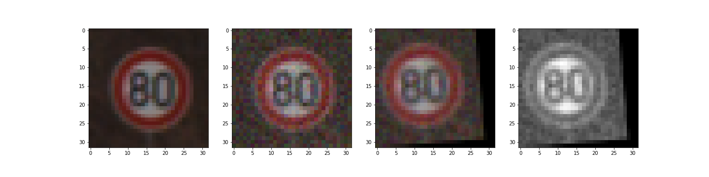
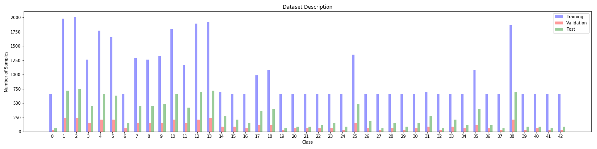

<!-- 
**********************************************************************
https://review.udacity.com/#!/rubrics/481/view 

Project Specification
Traffic Sign Classification

Dataset Exploration:
    1 - Dataset Summary: The submission includes a basic summary of the data set.
    2 - Exploratory Visualization: The submission includes an exploratory visualization on the dataset.

Design and Test a Model Architecture:
    3 - Preprocessing: The submission describes the preprocessing techniques used and why these techniques were chosen.
    4 - Model Architecture: The submission provides details of the characteristics and qualities of the architecture, including the type of model used, the number of layers, and the size of each layer. Visualizations emphasizing particular qualities of the architecture are encouraged.
    5 - Model Training: The submission describes how the model was trained by discussing what optimizer was used, batch size, number of epochs and values for hyperparameters.
    6 - The submission describes the approach to finding a solution. Accuracy on the validation set is 0.93 or greater.

Test a Model on New Images:
    7 - Acquiring New Images: The submission includes five new German Traffic signs found on the web, and the images are visualized. Discussion is made as to particular qualities of the images or traffic signs in the images that are of interest, such as whether they would be difficult for the model to classify.
    8 - Performance on New Images: The submission documents the performance of the model when tested on the captured images. The performance on the new images is compared to the accuracy results of the test set.
    9 - The top five softmax probabilities of the predictions on the captured images are outputted. The submission discusses how certain or uncertain the model is of its predictions.

Optional:
    VISUALIZE LAYERS OF THE NEURAL NETWORK

**********************************************************************
-->

# **P3 - Building a Traffic Sign Recognition/Classifier** 

### **Description**

In this project, I used what I've learned about deep neural networks and convolutional neural networks to classify traffic signs. Specifically, I trained a model to classify traffic signs from the [German Traffic Sign Dataset](http://benchmark.ini.rub.de/?section=gtsrb&subsection=dataset).

  

This repository is designed to be a simple, easy to use environment in which you can code run the Traffic Sign Classifier.

The goals / steps of this project are the following:
* Load the data set
* Explore, summarize and visualize the data set
* Design, train and test a model architecture
* Use the model to make predictions on new images
* Analyze the softmax probabilities of the new images
* Summarize the results with a written report

---
### **Used Methods**

The model is based on the LeNet arquitecture with some modifcactions. The tools and concepts that I used for the pipeline are Convolutional Neural Networks, Statical Invariance, Filters, Feature Map Sizes, CNNs visualization, pooling, backprop, regularization, droput, and others.

---
### **How to run**

To run the pipeline just launch and run the Jupyter notebook:

`Traffic_Sign_Classifier.ipynb`

Be sure that you alreade download the [German Traffic Sign Dataset](http://benchmark.ini.rub.de/?section=gtsrb&subsection=dataset) and is descompresed in the subfolder `traffic-signs-data`.

Tested on: python 3.5, OpenCV 3.0.0, UBUNTU 16.04, and TensorFlow 1.10.

Please feel free to change or modify any hyperparameter for training or change the model arquitecture. Some util functions are in the file `utils.py` in case you want to check or modify something.

---
### Data Set Summary & Exploration

<!-- 1. Provide a basic summary of the data set. In the code, the analysis should be done using python, numpy and/or pandas methods rather than hardcoding results manually. -->

The pickled data is a dictionary with 4 key/value pairs:

- `'features'` is a 4D array containing raw pixel data of the traffic sign images, (num examples, width, height, channels).
- `'labels'` is a 1D array containing the label/class id of the traffic sign. The file `signnames.csv` contains id -> name mappings for each id.
- `'sizes'` is a list containing tuples, (width, height) representing the original width and height the image.
- `'coords'` is a list containing tuples, (x1, y1, x2, y2) representing coordinates of a bounding box around the sign in the image.

The function `summary_data_sets()` in `utils.py` summarizes the dataset and print for each class the amount of samples for training, validation and testing process, showing its percentage in the dataset.

  

<!-- #### 2. Include an exploratory visualization of the dataset. -->

Here is an exploratory visualization of the data set. It is a bar chart showing how the data ...

  

  

---
### Design and Test a Model Architecture

<!-- #### 1. Describe how you preprocessed the image data. What techniques were chosen and why did you choose these techniques? Consider including images showing the output of each preprocessing technique. Pre-processing refers to techniques such as converting to grayscale, normalization, etc. (OPTIONAL: As described in the "Stand Out Suggestions" part of the rubric, if you generated additional data for training, describe why you decided to generate additional data, how you generated the data, and provide example images of the additional data. Then describe the characteristics of the augmented training set like number of images in the set, number of images for each class, etc.) -->

As a first step, I decided to convert the images to grayscale because ...

Here is an example of a traffic sign image before and after grayscaling.

![alt text][image2]

As a last step, I normalized the image data because ...

I decided to generate additional data because ... 

To add more data to the the data set, I used the following techniques because ... 

Here is an example of an original image and an augmented image:

![alt text][image3]

The difference between the original data set and the augmented data set is the following ... 

<!-- #### 2. Describe what your final model architecture looks like including model type, layers, layer sizes, connectivity, etc.) Consider including a diagram and/or table describing the final model. -->

My final model consisted of the following layers:

| Layer         		|     Description	        					| 
|:---------------------:|:---------------------------------------------:| 
| Input         		| 32x32x3 RGB image   							| 
| Convolution 3x3     	| 1x1 stride, same padding, outputs 32x32x64 	|
| RELU					|												|
| Max pooling	      	| 2x2 stride,  outputs 16x16x64 				|
| Convolution 3x3	    | etc.      									|
| Fully connected		| etc.        									|
| Softmax				| etc.        									|
|						|												|
|						|												|
 
<!-- #### 3. Describe how you trained your model. The discussion can include the type of optimizer, the batch size, number of epochs and any hyperparameters such as learning rate. -->

To train the model, I used an ....

<!-- #### 4. Describe the approach taken for finding a solution and getting the validation set accuracy to be at least 0.93. Include in the discussion the results on the training, validation and test sets and where in the code these were calculated. Your approach may have been an iterative process, in which case, outline the steps you took to get to the final solution and why you chose those steps. Perhaps your solution involved an already well known implementation or architecture. In this case, discuss why you think the architecture is suitable for the current problem. -->

My final model results were:
* training set accuracy of ?
* validation set accuracy of ? 
* test set accuracy of ?

If an iterative approach was chosen:
* What was the first architecture that was tried and why was it chosen?
* What were some problems with the initial architecture?
* How was the architecture adjusted and why was it adjusted? Typical adjustments could include choosing a different model architecture, adding or taking away layers (pooling, dropout, convolution, etc), using an activation function or changing the activation function. One common justification for adjusting an architecture would be due to overfitting or underfitting. A high accuracy on the training set but low accuracy on the validation set indicates over fitting; a low accuracy on both sets indicates under fitting.
* Which parameters were tuned? How were they adjusted and why?
* What are some of the important design choices and why were they chosen? For example, why might a convolution layer work well with this problem? How might a dropout layer help with creating a successful model?

If a well known architecture was chosen:
* What architecture was chosen?
* Why did you believe it would be relevant to the traffic sign application?
* How does the final model's accuracy on the training, validation and test set provide evidence that the model is working well?
 
---
### Test a Model on New Images

<!-- #### 1. Choose five German traffic signs found on the web and provide them in the report. For each image, discuss what quality or qualities might be difficult to classify. -->

Here are five German traffic signs that I found on the web:

![alt text][image4] ![alt text][image5] ![alt text][image6] 
![alt text][image7] ![alt text][image8]

The first image might be difficult to classify because ...

<!-- #### 2. Discuss the model's predictions on these new traffic signs and compare the results to predicting on the test set. At a minimum, discuss what the predictions were, the accuracy on these new predictions, and compare the accuracy to the accuracy on the test set (OPTIONAL: Discuss the results in more detail as described in the "Stand Out Suggestions" part of the rubric). -->

Here are the results of the prediction:

| Image			        |     Prediction	        					| 
|:---------------------:|:---------------------------------------------:| 
| Stop Sign      		| Stop sign   									| 
| U-turn     			| U-turn 										|
| Yield					| Yield											|
| 100 km/h	      		| Bumpy Road					 				|
| Slippery Road			| Slippery Road      							|

The model was able to correctly guess 4 of the 5 traffic signs, which gives an accuracy of 80%. This compares favorably to the accuracy on the test set of ...

<!-- #### 3. Describe how certain the model is when predicting on each of the five new images by looking at the softmax probabilities for each prediction. Provide the top 5 softmax probabilities for each image along with the sign type of each probability. (OPTIONAL: as described in the "Stand Out Suggestions" part of the rubric, visualizations can also be provided such as bar charts) -->

The code for making predictions on my final model is located in the 11th cell of the Ipython notebook.

For the first image, the model is relatively sure that this is a stop sign (probability of 0.6), and the image does contain a stop sign. The top five soft max probabilities were

| Probability         	|     Prediction	        					| 
|:---------------------:|:---------------------------------------------:| 
| .60         			| Stop sign   									| 
| .20     				| U-turn 										|
| .05					| Yield											|
| .04	      			| Bumpy Road					 				|
| .01				    | Slippery Road      							|

For the second image ... 

---
### (Optional) Visualizing the Neural Network (See Step 4 of the Ipython notebook for more details)
<!-- #### 1. Discuss the visual output of your trained network's feature maps. What characteristics did the neural network use to make classifications? -->

While neural networks can be a great learning device they are often referred to as a black box, here we will explore a technique that lets us shine a light into that black box and see closer what it looks like on the inside by observing the kind of shadows that are formed. These shadows will be our feature maps, and after successfully training your neural network you can see what it's feature maps look like by plotting the output of the network's weight layers in response to a test stimuli image, which will be our light. From these plotted feature maps, it's possible to see what characteristics of an image the network finds interesting. For a sign, maybe the inner network feature maps react with high activation to the sign's boundary outline or to the contrast in the sign's painted symbol.

---

### **Potential Shortcomings**

---

### **Possible Improvements**

---

### **Discussion**

---

> **Date:** &nbsp; 03/20/2019  
> **Programmer:** &nbsp;John A. Betancourt G.   
> **Mail:** &nbsp;john.betancourt93@gmail.com  
> **Web:** &nbsp; www.linkedin.com/in/jhon-alberto-betancourt-gonzalez-345557129 

  

<!-- Sorry for my English -->

  
    
  

 

 

 

 
 

 
 
 
